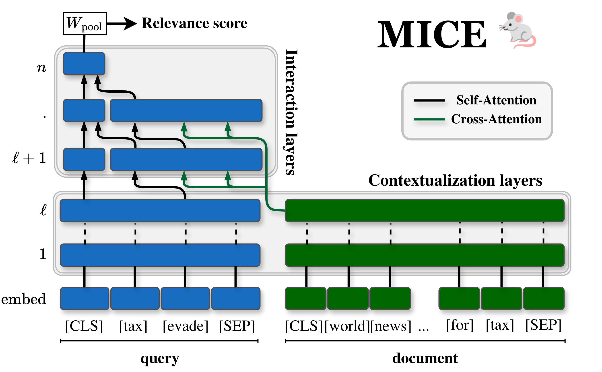

<div align="center">

<h1>MICE: Minimal Interaction Cross-Encoders for efficient Re-ranking</h1>
<div>
    <a href=https://scholar.google.com/citations?user=QGCo1PAAAAAJ&hl target='_blank'>Mathias Vast</a><sup>12</sup>&emsp;
    <a href='https://victormorand.github.io/' target='_blank'>Victor Morand</a><sup>1</sup>&emsp;
    <a target='_blank'>Basile van Cooten</a><sup>2</sup>&emsp;
    <a href='https://scholar.google.fr/citations?user=3gUQp6oAAAAJ&hl' target='_blank'>Laure Soulier</a><sup>1</sup>&emsp;
    <a href='https://scholar.google.com/citations?user=V-Nyr0wAAAAJ' target='_blank'>Josiane Mothe</a><sup>3</sup>&emsp;
    <a href='https://www.piwowarski.fr' target='_blank'>Benjamin Piwowarski</a><sup>1</sup>&emsp;
</div>
<br>
<div>
    <sup>1</sup>Sorbonne Université, CNRS, ISIR, F-75005 Paris, France&emsp;<br>
    <sup>2</sup>ChapsVision, Paris, France&emsp;<br>
    <sup>3</sup>IRIT, Université de Toulouse, UMR5505 CNRS, F-31400 Toulouse, France&emsp;<br>
</div>
<br>


</div>

### Abstract 

> _Cross-encoders deliver state-of-the-art ranking effectiveness in information retrieval, but have a high inference cost. This  prevents them from being used as first-stage rankers, but also incurs a cost when re-ranking documents.
Prior work has addressed this bottleneck from two largely separate directions: accelerating cross-encoder inference by sparsifying the attention process or improving first-stage retrieval effectiveness using more complex models, e.g. late-interaction ones.
In this work, we  propose to bridge these two approaches, based on an in-depth understanding of the internal mechanisms of cross-encoders. Starting from cross-encoders, we show that it is possible to derive a new late-interaction-like architecture by carefully removing detrimental or unnecessary interactions. We name this architecture MICE (Minimal Interaction Cross-Encoders). We extensively evaluate MICE across both in-domain (ID) and out-of-domain (OOD) datasets. 
MICE decreases fourfold the inference latency compared to standard cross-encoders, matching late-interaction models like ColBERT while retaining most of cross-encoder ID effectiveness and demonstrating superior generalization abilities in OOD._

### Installation
To install this repository, first ensure you have `git` and `uv` installed.

1.  Clone the repository and its submodules:
    ```bash
    git clone --recurse-submodules git@github.com:xpmir/mice.git
    cd mice
    ```
    If you have already cloned the repository without `--recurse-submodules`, you can initialize and update them with:
    ```bash
    git submodule update --init --recursive
    ```

2.  Synchronize the Python dependencies using `uv`:
    ```bash
    uv sync
    ```

### Running experiments
[Experimaestro](https://github.com/experimaestro/experimaestro-python) is used to launch and monitor experiments.
You can run an experiment training a MICE Model based on the MiniLM-L12-v2 backbone using the following command:

```bash
uv run experimaestro run-experiment src/midFusion_training/midfusion_minilm_l4.yaml
```

### Acknowledgements
We depend on several key packages:
- [`experimaestro-python`](https://github.com/experimaestro/experimaestro-python) for experiment management.
- [`ir-datasets`](https://ir-datasets.com/) to access IR collections.

### Citation

The paper is currently under-review and the citation will be updated following the notifications.